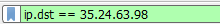

= Tech Exploration 4 - Wireshark Filters
Author: Anthony Cavalieri

== About Wireshark

Wireshark is an essential tool in any networking based career, but especially in security. Created in the late 1990's, Wireshark is free and open-source, so that all may use it.
By capturing data on the network, and making it human readable, users can easily find, understand, and solve problems on the network.  While Wireshark is a very powerful tool in many
aspects, filters are arguably the most powerful aspect of the program. This tutorial will cover 4 essential filters, and show the user how to user and/or read them.

== Prerequisites

Wireshark can be used on almost any device, and can be used with either a GUI or through the command line. This tutorial will be using the GUI, but can be preformed on any supported OS.

* Supported OS (Windows, Mac, Linux)

* Installation of Wireshark

* Working NIC

== Learning Objectives

* Improve on using Wireshark so that the learner can be more effective in future positions after graduation.

* Teach classmates functions that they may not know, so that they may be better suited for future use of the tool.

* Be able to apply and understand filters that are applied to a Wireshark session, being able to customize the filters to fit the user’s specific needs.

== Instructions
TCP/UDP Contains
^^^^^^^^^^^^^^^^
The 'contains' filter is a very simple, yet effective filter, which allows you to search for any plaintext word in a TCP or UDP stream in Wireshark.
For example, to search for web traffic related to Twitter, you would do the following:

Step 1. In the 'Add a Display Filter' search bar, type in 'tcp contains twitter'.
				TCP can be replaced with UDP, and twitter can be replaced with anything that you'd like to filter for.

					
Step 2. Hit 'Enter' or the arrow button to the right of the search bar to apply the filter.

Step 3. View the results of the filter. 
			If nothing shows up, navigate to the website, and browse for a small amount of time. 

In the results at the bottom of Wireshark, you will be able to see some of the data within the captured traffic. You can see here that this filter worked, as the data shows 'twitter' in the results.

image::twitter.png[]
			
!(arp or icmp or dns)
^^^^^^^^^^^^^^^^^^^^^

This filter will discard arp, icmp, and dns requests sent on the network. These results are usually the bulk of your results, but are not always helpful, and can just take up space.
By applying this filter you will be able to view more important traffic, without having to dig through all of these requests.

Step 1. In the 'Add a Display Filter' search bar, type in '!(arp or icmp or dns)'.

 

Step 2. Hit 'Enter' or the arrow button to the right of the search bar to apply the filter.

Step 3. View the results of the filter. 
			You will likely still have quite a few results, but will not see any of the specified protocols in the Protocols column in the results pane.
			You can also add more exclusions by adding more to the protocols in the parenthesis.

ip.addr == 
^^^^^^^^^^

This filter allows you to view traffic for a specific IP address, which can help immensely when trying to view specific traffic on the network. 

Step 1. In the 'Add a Display Filter' search bar, type in 'ip.addr == x.x.x.x', replacing the x's with the desired IP address.

 

Step 2. Hit 'Enter' or the arrow button to the right of the search bar to apply the filter.

Step 3. View the results of the filter. 

This filter can be further specified into source and destination IP addresses. You can do this by using the filters 'ip.src == ', and 'ip.dst == ', as shown below.

	
tcp.stream
^^^^^^^^^^
This filter allows you to piece together a string of packets to view the data that they contain. This will work better with HTTP traffic, as opposed to HTTPS, as the encryption
makes the data unreadable. 

. Step 1. This filter can be used with manual filter entry, however, this is much more complicated than just right clicking a packet and selecting 'Follow TCP/UDP Stream'.
			Note: There are also options for HTTP and TLS streams, but the majority of the packets captured are going to be TCP or UDP.
			

 

image::udp stream.png[] 

Step 2. Left click on the TCP/UDP stream option.

Step 3. View the results of the TCP/UDP conversation.  

 

 

You can see above that the individual packet data gets put into a more human readable form, and is much easier to understand. This TCP conversation was unencrpyted, so it is plain
text readable. 

This _can_ be done with HTTPS (encrypted) traffic, but it will almost definitely be unreadable, as shown below.

== Challenge

Go out and try these filters on your own! Use these specific filters, find other ways to use them, or find filters not shown here.

Try this on your home network, see what data you capture, and what you can make of it. You might be sending data you didn't know about.

Go out and try other packet sniffing programs, and compare them to Wireshark:

* Are they better/worse? 

* Any features that you can't find in Wireshark?

* Do the same filters for Wireshark work in the other program(s)?

**Disclaimer** 
~~~~~~~~~~~~~~
Sniffing packets on a network you do not have permission to sniff is illegal, and can get you in serious trouble. This tutorial did not go over promiscuous mode, due to
NMU laptop NICs not supporting it. However, turning on promiscuous mode will allow you to see _all_ available traffic on the network. Keep promiscuous mode off, and stay on a 
home network to ensure you are in compliance with best network practices.

== Reflection

Now that you have learned some useful filters for Wireshark, and have a better understanding of the program, consider the following:

* In what situations could you use Wireshark to find/solve issues on the network?

* What should you do if you find someone using Wireshark (or another packet sniffer) on your network?

* In what situation(s) is turning on promiscuous mode okay?

* What other programs could you use in conjunction with Wireshark to utilize the captured data?

